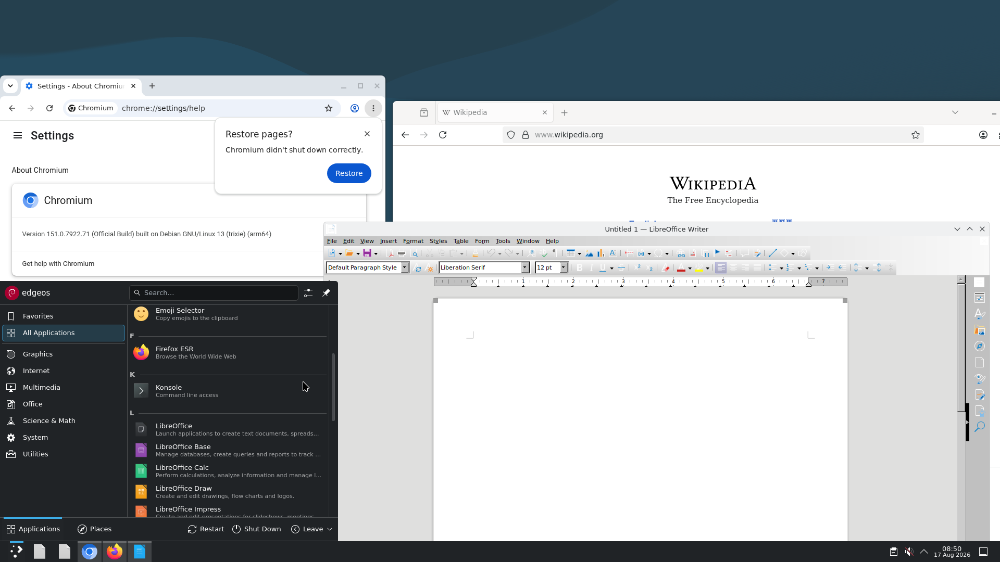
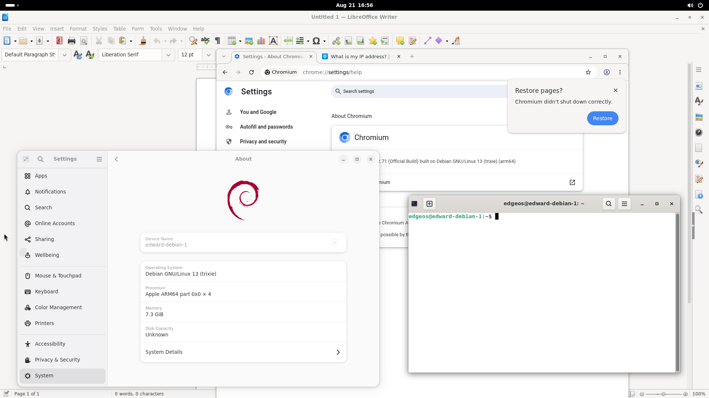

# EdgeOS





EdgeOS is an independent Unix-like kernel for x86_64 and AArch64. It is not a
Linux fork. Linux userspace is the compatibility target: the kernel loads Linux
ELF64 binaries and implements the Linux-facing system call and device
interfaces needed by existing software.

Development systems currently boot Debian with systemd on both architectures.
X11/XFCE, KDE Plasma and GNOME on Wayland, Chromium, Firefox, LibreOffice and
Docker have all been run on EdgeOS development VMs using unmodified Debian
packages.

This repository contains the kernel. Root filesystems, desktop packages and
virtual-machine management tools are separate projects.

## Current tree

| | Count |
| --- | ---: |
| Canonical Linux syscall IDs | 385 |
| Shared syscall handlers | 358 |
| AArch64 policies using shared handlers | 321 |
| BSD driver manifests | 261 |
| Buildable BSD driver packages | 256 |
| Source-locked BSD files | 2,866 |

The syscall figures come from `tools/syscalls/linux_syscall_inventory.json`.
The driver figures come from the generated BSD Bridge build plan and source
locks. These inventories are checked during the build.

## Kernel

Architecture directories contain entry code, context switching, interrupt
plumbing, page-table operations and platform bring-up. Process semantics, VFS,
networking, scheduling, IPC and Linux-visible behavior are shared. A feature
implemented in common code is built into both architecture targets.

| Area | Present in the tree |
| --- | --- |
| Boot | x86 Multiboot/Multiboot2, AArch64 UEFI, Linux-style kernel command line, block-root selection and cpio or gzip-compressed initramfs |
| Linux ABI | Linux ELF64, architecture syscall tables, vDSO, Linux ioctls, socket interfaces and the procfs/sysfs/devtmpfs device model |
| Processes | `fork`, `vfork`, `clone`, `clone3`, exec, signals, sessions, process groups, ptrace, pidfds, process waiting and resource accounting |
| Credentials and limits | UIDs, GIDs, supplementary groups, Linux capabilities, securebits, `prctl`, resource limits and file permissions |
| Namespaces and cgroups | Mount, PID, user, UTS, IPC, network, time and cgroup namespaces; cgroup v2 CPU, cpuset, memory, swap, PIDs, I/O and freezer controls |
| Scheduling | SMP scheduling, affinity, nice levels, `SCHED_OTHER`, `BATCH`, `IDLE`, `FIFO`, `RR` and `DEADLINE`, CPU cgroup controls and utilization clamps |
| Memory | VMAs, anonymous and file mappings, COW, `mmap`, `mprotect`, `mremap`, `madvise`, page cache, reclaim, OOM handling, pressure reporting and swap |
| Synchronization | wait queues, futexes, robust futex lists, futex requeue and waitv, membarrier, mutexes, spinlocks, deferred work and BSD bridge epoch primitives |
| IPC and events | pipes, PTYs, SysV shared memory, Unix sockets, epoll, eventfd, signalfd, inotify and descriptor passing with `SCM_RIGHTS` |
| Time | POSIX clocks and timers, interval timers, timerfd, nanosleep, RTC, HPET and architecture timer backends |
| VFS | path and inode caches, mount namespaces, modern mount API, descriptors, xattrs, file locks, sparse files, readahead and writeback |
| Filesystems | tmpfs, initramfs, ext2, ext4, FAT32, FUSE, OverlayFS, cgroup2 and NFSv3 server; read-only SquashFS, EROFS, XFS, Btrfs, exFAT, NTFS, ISO9660 and UDF paths |
| Storage | block cache, partition discovery, RAM disks, loop devices, device mapper, VirtIO Block/SCSI, NVMe, AHCI, ATA and VMware PVSCSI |
| Network protocols | IPv4, IPv6, ARP, NDP, ICMP, TCP, UDP, IGMP/MLD multicast, Unix sockets and packet sockets |
| Network control | rtnetlink, generic netlink, sock_diag, ethtool, IPv4/IPv6 routing, policy and multipath routes, qdiscs, nftables hooks, NAT and connection tracking |
| Virtual networking | TUN/TAP, veth, bridge with FDB/MDB and VLAN filtering, VLAN, macvlan, ipvlan, bonding, dummy and VRF devices |
| Native network devices | Intel e1000, Realtek r8169 and VirtIO Net; additional Ethernet, Wi-Fi and USB network families are provided through the BSD Driver Bridge |
| Display | EFI GOP, framebuffer console, 63 virtual terminals, fbdev, DRM/KMS, EDID/DisplayID modes, Bochs BGA, VMware SVGA and VirtIO GPU 2D/3D paths |
| Input | PS/2 keyboard and mouse, Synaptics and Elan touchpads, USB HID, VirtIO Input and Linux input/event device interfaces |
| Audio | ALSA-facing PCM/control devices with HDA, AC97, USB audio and BSD bridge audio backends |
| USB | Hub and device enumeration, UHCI, OHCI, EHCI and xHCI hosts, HID, mass storage and audio; bridge packages add further host, gadget and device classes |
| Virtual machine devices | VirtIO PCI/MMIO block, SCSI, network, GPU, input, RNG, console and balloon devices, plus VMware storage and display devices |
| Firmware and buses | ACPI/ACPICA, Device Tree, EFI runtime, PCI/PCIe, MSI/MSI-X, I2C, SMBus, GPIO, SD/MMC bridge packages and firmware loading |
| Multiprocessing | x86 APIC/IOAPIC and AArch64 GICv3/PSCI bring-up, per-CPU state, reschedule IPIs, TLB shootdown and cross-CPU membarrier |
| Hardware services | ACPI power, battery and thermal data, CPU frequency control, RTC, RNG, TPM 2.0, watchdogs and LED/GPIO bridge interfaces |
| Board targets | Generic x86_64 PCs, generic AArch64 UEFI/virt systems, and build targets for Raspberry Pi 4 and Raspberry Pi 5 |
| BSD Driver Bridge | Source-locked build packages for storage, Ethernet, Wi-Fi, USB, input, audio, firmware, platform, sensor and watchdog driver families |

Linux ABI work is not finished. An inventory entry means that a route and
implementation exist; it does not mean every corner case matches every Linux
release. Hardware support has the same distinction: compiling a driver is not
proof that it has been tested on every device it recognizes. The default
x86_64 and AArch64 configurations differ where the hardware requires different
drivers.

## BSD Driver Bridge

The BSD Driver Bridge builds selected FreeBSD drivers from their upstream
source files. EdgeOS supplies the kernel services expected by those drivers;
device-specific state machines and recovery code remain upstream.

Imported files are kept under `src/compat/freebsd/upstream/`. Each package has
a manifest that records its upstream revision, source paths, license data,
capability requirements and a deterministic source digest. EdgeOS adaptation
belongs in `include/compat/freebsd/`, `src/compat/freebsd/` or a native frontend,
not in the imported driver.

The bridge provides source compatibility, not FreeBSD binary module
compatibility. Package and source checks reject missing files, unexpected
changes and unsupported capability combinations. See
[`docs/bsd-driver-bridge.md`](docs/bsd-driver-bridge.md) for the import and
validation rules.

## Build

The build requires GNU Make, Python 3, Clang/LLVM, LLD and NASM. The cross
toolchains used by the Makefile must also be available in `PATH`.

### x86_64

```sh
make defconfig
make -j"$(getconf _NPROCESSORS_ONLN)" kernel
```

Output: `out/edgeos.bin`

### AArch64 UEFI

```sh
make arm64_defconfig
make -j"$(getconf _NPROCESSORS_ONLN)" arm64-kernel
```

Output: `out/arm64/BOOTAA64.EFI`

Configuration menus:

```sh
make menuconfig
make arm64-menuconfig
```

The Makefile also has targets for x86_64 initramfs media, AArch64 UEFI media,
Raspberry Pi 4 and Raspberry Pi 5. An initramfs can be built from an existing
root filesystem:

```sh
make INITRAMFS_SOURCE_DIR=/path/to/rootfs initramfs
```

## Checks

Run both architecture builds after changing shared kernel code. The core
repository checks are:

```sh
make kconfig-check
make syscall-inventory-check
make cross-arch-unity-check
make bsd-driver-build-plan-check
make bsd-driver-manifest-check
```

Focused unit targets for the scheduler, VFS, memory manager, network stack,
filesystems and driver bridge are listed in the Makefile and under
`tools/tests/`.

## Source layout

```text
arch/                       defconfig files
config/                     boot and driver configuration
include/                    kernel, UAPI and compatibility headers
src/arch/                   architecture mechanisms
src/kernel/                 shared process and kernel services
src/mm/                     memory management
src/vfs/ and src/fs/        VFS and filesystems
src/net/                    network stack
src/drivers/                native drivers
src/compat/freebsd/         BSD Driver Bridge and imported sources
tools/                      build tools, inventories and tests
```

The architecture ownership rules are documented in
[`docs/kernel-layout.md`](docs/kernel-layout.md).

## License

Original EdgeOS code is licensed under the Mozilla Public License 2.0.
Imported files keep their original licenses and notices. See [`NOTICE.md`](NOTICE.md)
and the notices beside each imported source tree.

See [`CONTRIBUTING.md`](CONTRIBUTING.md) before submitting changes.
